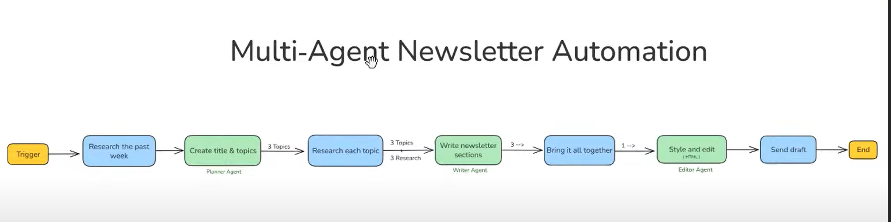

# 🧠 Multi-Agent Newsletter Automation

An **AI-powered newsletter automation system** built using **n8n**, designed to streamline newsletter creation using multiple AI agents.  
It automates topic research, content generation, editing, and email delivery — all without manual intervention.

---

## 📊 Workflow Overview



### 🔁 **End-to-End Flow**
1. **Trigger** → The workflow starts on a scheduled basis (e.g., weekly).
2. **Research the Past Week** → An agent gathers trending or relevant topics from the past week.
3. **Create Title & Topics (Planner Agent)** → Generates the main newsletter theme and selects 3 key subtopics.
4. **Research Each Topic** → Collects insights, summaries, or supporting information for each topic.
5. **Write Newsletter Sections (Writer Agent)** → Drafts each section of the newsletter in a structured, engaging format.
6. **Bring It All Together** → Combines all sections into a cohesive newsletter draft.
7. **Style and Edit (Editor Agent)** → Applies HTML formatting and proofreading for a clean, publish-ready output.
8. **Send Draft** → Emails the draft newsletter for review or publication.
9. **End** → Workflow completes automatically.

---

## ⚙️ Features

- 🧩 **Multi-Agent System**: Planner, Writer, and Editor agents work collaboratively.
- 🤖 **AI-Integrated**: Uses ChatGPT (or compatible LLMs) for research, writing, and editing.
- 🔄 **Fully Automated**: From idea generation to final email delivery.
- 🗓️ **Schedule Ready**: Runs on weekly triggers.
- 🌐 **Extensible**: Easily connect with external APIs or databases via n8n.
- 💌 **Customizable Output**: HTML-formatted newsletter ready for sending.

---

## 🧩 Tech Stack

| Category | Tools / Frameworks |
|-----------|--------------------|
| Automation Platform | [n8n](https://n8n.io) |
| AI / LLM | OpenAI (ChatGPT) / compatible APIs |
| Integration | Webhooks, Email, HTTP, JSON |
| Hosting | n8n Cloud / Local Instance |
| Output | HTML Newsletter |

---

## 🚀 Getting Started

### 1. Clone the Repository
```bash
git clone https://github.com/<your-username>/Multi-Agent-Newsletter-Automation.git
cd Multi-Agent-Newsletter-Automation
